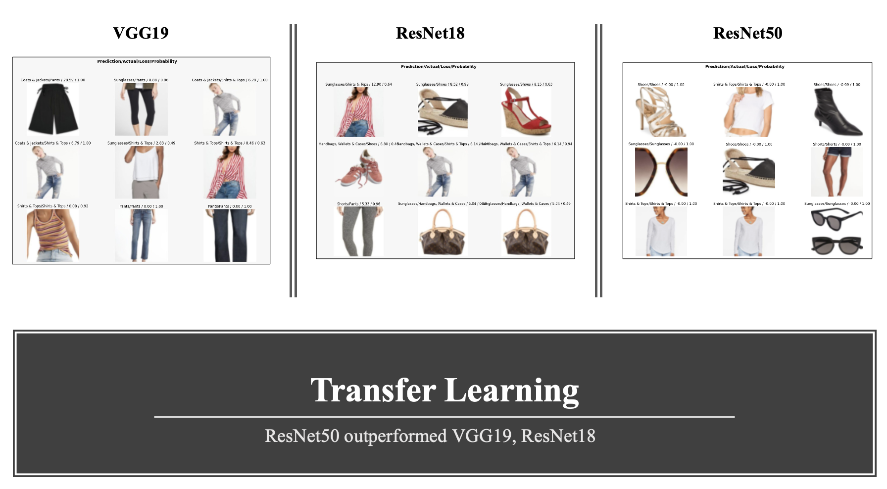

# Fashion_Recommendation_System

It is a challenging task to develop a fashion suggestion system due to its subjectivity and complexity. While collaborative filtering and content-based filtering are quite popular in conventional recommendation systems, they are quite ineffective in the fashion industry. Considering that the visual signals are a key feature in fashion analysis, this fashion recommendation system finds visial similarities among products, outfits and scenes to recommend fashion products to users. To find the image similarity, cosine similarity and Spotify's Annoy model is used on Pinterest's Shop The Look dataset.

